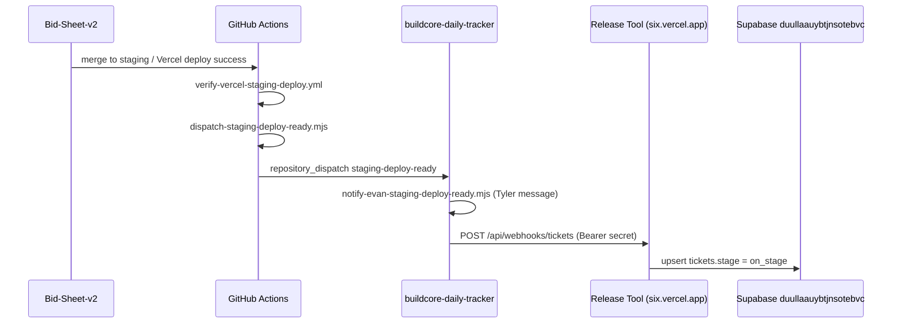

# Claude Code handoff — BuildCore Release Tool + staging automation

**Read this first** when continuing work from the Cursor session (June 2026). Shorter ops docs: `SOURCE-OF-TRUTH.md`, `TEAM-LOGIN.md`.

---

## What this product is

**BuildCore Release Tool** is a Next.js app for release planning: projects, roadmap, features, tickets (BC-PORTAL-* refs), stages, testing notes, and activity feed. It is **intentionally isolated** from Bid-Sheet production DB/code — only **inbound webhooks** update ticket stages; nothing writes back to `bid-sheet-v2`.

**Users today:** Evan (eng), Tyler (product owner), Alex (member). They need one URL, real login, and Tyler’s tracker data — not a second empty database or Tyler configuring BunkWorx Vercel.

---

## Original session goal

1. When **Bid-Sheet-v2** merges to **`staging`** and Vercel staging deploy succeeds, linked **BC-PORTAL-*** tickets should move to **`on_stage`** in the release tool automatically.
2. **One production stack** Evan controls (Vercel + Supabase), with Tyler’s migrated data.
3. **Evan, Tyler, and Alex** can sign in and see the same tracker (no shared internet password, no Tyler env-var setup).

**Reference PR/tickets:** Bid-Sheet PR **#2612**, tickets **BC-PORTAL-8538–8547** (verified `on_stage` in BunkWorx DB).

---

## Canonical production stack (only use this)

| Layer | Value |
|--------|--------|
| **App URL** | https://buildcore-release-tool-six.vercel.app |
| **Login** | https://buildcore-release-tool-six.vercel.app/login |
| **Vercel project** | `bunkworks/buildcore-release-tool` |
| **GitHub repo** | https://github.com/BunkWorx/buildcore-release-tool |
| **Local path** | `/Users/evanedge/Projects/buildcore-release-tool` |
| **Supabase project** | `buildcore-release-tool` — ref **`duullaauybtjnsotebvc`** (BunkWorx org) |
| **Supabase dashboard** | https://supabase.com/dashboard/project/duullaauybtjnsotebvc |
| **Bid Sheet v2 project row UUID** | `11111111-1111-1111-1111-000000000001` |

### Deprecated — do not use or re-wire

| Layer | Value |
|--------|--------|
| Old app URL | https://buildcore-release-tool.vercel.app |
| Tyler’s personal Supabase | `fbrdhbxfkxywzokbdznv` |

Data from Tyler’s DB was **copied into** `duullaauybtjnsotebvc` on **2026-06-02** (8 projects, full roadmap/tickets). Re-copy script was named `scripts/migrate-tyler-to-bunkworx.mjs` in session docs — **may not be in repo**; check before relying on it.

---

## End-to-end staging → tracker flow



### Repos and files

| Repo | Role | Key paths |
|------|------|-----------|
| **evanedgeworth/Bid-Sheet-v2** | Staging deploy + dispatch | `scripts/dispatch-staging-deploy-ready.mjs`, `.github/workflows/verify-vercel-staging-deploy.yml` |
| **BunkWorx/buildcore-daily-tracker** | Tyler notifications + **release-tool sync** | `.github/workflows/staging-deploy-ready.yml`, `scripts/sync-staging-to-release-tool.mjs` |
| **BunkWorx/buildcore-release-tool** | App + webhook API | `src/app/api/webhooks/tickets/route.ts` |

### Dispatch payload (Bid-Sheet → daily-tracker)

`dispatch-staging-deploy-ready.mjs` sends `repository_dispatch` to `BunkWorx/buildcore-daily-tracker` with fields including:

- `prNumber`, `prTitle`, `prUrl`, `mergeSha`, `outcome`
- **`portalTicketRefs`** — comma-separated BC-PORTAL-* from PR title/body (important when tracker token cannot read private Bid-Sheet)

### Daily-tracker sync step

Workflow: `buildcore-daily-tracker/.github/workflows/staging-deploy-ready.yml`

Env for sync job:

- `RELEASE_TOOL_WEBHOOK_URL` = `https://buildcore-release-tool-six.vercel.app/api/webhooks/tickets`
- `RELEASE_TOOL_TICKETS_WEBHOOK_SECRET` = GitHub org/repo secret (must match Vercel)
- `RELEASE_TOOL_BID_SHEET_PROJECT_ID` = `11111111-1111-1111-1111-000000000001`
- `PORTAL_TICKET_REFS` from dispatch payload

Script: `scripts/sync-staging-to-release-tool.mjs`

- Only runs when `outcome=success`
- Extracts BC-PORTAL-* from PR text or `PORTAL_TICKET_REFS`
- **POST** each ref with `Authorization: Bearer <secret>`, body `{ ref, stage: "on_stage", project_id, ... }`

### Release-tool webhook

`POST /api/webhooks/tickets`

- Auth: `Authorization: Bearer <TICKETS_WEBHOOK_SECRET>` (must match GitHub `RELEASE_TOOL_TICKETS_WEBHOOK_SECRET`)
- Upserts `tickets` by `ref`, sets `stage`, writes activity rows
- Valid stages: `created`, `in_dev`, `on_stage`, `ready`, `live`

**Session fix:** `TICKETS_WEBHOOK_SECRET` on Vercel production had been **empty** (automation would fail on next deploy). Reset to a new random value, mirrored to GitHub secret, production redeployed; test returned `{"ok":true,"ref":"BC-PORTAL-8538","stage":"on_stage"}`.

---

## Auth (replaced shared `GATE_PASSWORD`)

### Behavior

- Supabase **email/password** via `@supabase/ssr` middleware
- **Invite-only:** `RELEASE_TOOL_ALLOWED_EMAILS` on Vercel (comma-separated)
- **Fallback** in code if allowlist env is empty string: `src/lib/auth/allowed-emails.ts` hardcodes the three BuildCore emails in production
- Profiles: table `release_tool_profiles` (display name, role) — sidebar greeting
- Migration: `supabase/migrations/0003_auth_profiles_and_rls.sql` (tightened RLS; removed anon read on sensitive data)

### Allowed emails (production)

- `evan@mybuildcore.com` — profile **Evan / Engineering**
- `tyler.woodworth@mybuildcore.com` — **Tyler / Product owner**
- `alex.bilba@mybuildcore.com` — **Alex / Member**

### Provision / reset password

```bash
cd /Users/evanedge/Projects/buildcore-release-tool
export SUPABASE_SERVICE_ROLE_KEY='<from Supabase dashboard API settings>'
node scripts/provision-release-tool-user.mjs <email> <password> "<Display Name>" "<Role>"
```

Supabase Auth redirect URL (production): `https://buildcore-release-tool-six.vercel.app/auth/callback`

**Passwords:** Last temp passwords were set in the Cursor closeout session — **do not commit passwords**. Store in 1Password; re-run provision script if unknown.

### Login troubleshooting

| Symptom | Cause | Fix |
|---------|--------|-----|
| `not_invited` after correct password | Empty `RELEASE_TOOL_ALLOWED_EMAILS` on Vercel | Set allowlist in Vercel production + redeploy; fallback in code should still allow the three emails |
| Webhook 401 | `TICKETS_WEBHOOK_SECRET` mismatch or empty | Set same value on Vercel `TICKETS_WEBHOOK_SECRET` and GitHub `RELEASE_TOOL_TICKETS_WEBHOOK_SECRET`, redeploy |
| `vercel env pull` shows secret len 0 | Encrypted vars are not exported in pull | Use `vercel env add ... --force` + `gh secret set` + `vercel deploy --prod` |

---

## Vercel production env (names)

From `.env.example` — set in https://vercel.com/bunkworks/buildcore-release-tool/settings/environment-variables

| Variable | Purpose |
|----------|---------|
| `NEXT_PUBLIC_SUPABASE_URL` | Supabase API URL |
| `NEXT_PUBLIC_SUPABASE_ANON_KEY` | Browser client |
| `SUPABASE_SERVICE_ROLE_KEY` | Server + webhooks |
| `RELEASE_TOOL_ALLOWED_EMAILS` | Invite allowlist |
| `TICKETS_WEBHOOK_SECRET` | Ticket webhook Bearer token |
| `GITHUB_WEBHOOK_SECRET`, `FEEDBACK_WEBHOOK_SECRET` | Other webhooks (if used) |

**Note:** README.md at repo root is **stale** (still lists old URL and `GATE_PASSWORD`). Trust this doc and `docs/SOURCE-OF-TRUTH.md`.

---

## GitHub secrets

| Repo | Secret | Must match |
|------|--------|------------|
| `BunkWorx/buildcore-daily-tracker` | `RELEASE_TOOL_TICKETS_WEBHOOK_SECRET` | Vercel `TICKETS_WEBHOOK_SECRET` |

---

## Database schema (high level)

Postgres in `duullaauybtjnsotebvc`:

- `projects`, `features`, `tickets` (unique `ref`, column **`stage`** not `status`)
- `feature_tickets`, `ticket_activity`, `activity_events`, etc.
- `release_tool_profiles` linked to `auth.users`

Ticket stage for BC-PORTAL-8538–8547: all **`on_stage`** as of session closeout.

---

## What was done in the Cursor session (chronological themes)

1. **Consolidated stack** — abandoned second empty BunkWorx DB + “Tyler sets Vercel env” path; migrated Tyler’s Supabase data into org project `duullaauybtjnsotebvc`.
2. **Wired staging automation** — daily-tracker workflow posts to **six** webhook URL; Bid-Sheet dispatch includes `portalTicketRefs`.
3. **Replaced gate password** with Supabase invite auth, profiles, middleware, `/login`, allowlist.
4. **Fixed production login** — empty allowlist caused `not_invited`; added `allowed-emails.ts` fallback + Vercel allowlist.
5. **Provisioned** Evan, Tyler, Alex; removed stray `evanedge1@gmail.com` auth user.
6. **Fixed webhook secret** — was empty on Vercel; regenerated, synced to GitHub, redeployed, verified HTTP 200.
7. **Docs** — `docs/SOURCE-OF-TRUTH.md`, `docs/TEAM-LOGIN.md`, this file.

---

## What NOT to do again

- Create another Supabase project “for automation” while real data lives elsewhere.
- Ask Tyler to configure `bunkworks/*` Vercel env or service role keys.
- Use `buildcore-release-tool.vercel.app` or Supabase `fbrdhbxfkxywzokbdznv` as production.
- Reintroduce shared `GATE_PASSWORD` as the only auth in production.
- Assume `vercel env pull` shows secret values (it does not for encrypted vars).

---

## Local dev (Claude Code)

```bash
cd /Users/evanedge/Projects/buildcore-release-tool
npm install
cp .env.example .env.local
# Fill: Supabase URL/keys from duullaauybtjnsotebvc, allowlist, optional TICKETS_WEBHOOK_SECRET
npm run dev -- --port 3100
```

Link Vercel (if deploying): `vercel link` → `bunkworks/buildcore-release-tool`

---

## Verification commands

```bash
# Production login page
curl -sS -o /dev/null -w "%{http_code}\n" https://buildcore-release-tool-six.vercel.app/login

# Webhook (use current TICKETS_WEBHOOK_SECRET from Vercel dashboard, not pull)
curl -sS -X POST https://buildcore-release-tool-six.vercel.app/api/webhooks/tickets \
  -H "Authorization: Bearer $SECRET" \
  -H "Content-Type: application/json" \
  -d '{"ref":"BC-PORTAL-8538","stage":"on_stage","project_id":"11111111-1111-1111-1111-000000000001"}'

# Ticket stages (service role)
# GET .../rest/v1/tickets?ref=eq.BC-PORTAL-8538&select=ref,stage
```

---

## Related work outside this repo

- **Tyler staging notifications** — daily-tracker `notify-evan-staging-deploy-ready.mjs` (testability classes, Linear/email) — separate from release-tool sync but same `staging-deploy-ready` dispatch.
- **dev.app.mybuildcore.com** SSO/redirect issues — Bid-Sheet dev environment; **not** the release tool.
- **GitHub issue #2** (if still open) — handoff discussion for release tool; safe to close with link to this doc.

---

## Suggested next steps in Claude Code

1. Update root `README.md` production URL and auth section to match reality.
2. Commit/push `docs/CLAUDE-CODE-HANDOFF.md` if not on `main`.
3. Confirm Tyler/Alex changed temp passwords (or re-provision).
4. Optional: restore `scripts/migrate-tyler-to-bunkworx.mjs` if you need incremental re-sync from legacy DB.
5. Optional: add smoke test workflow that hits `/login` + webhook with repo secrets.

---

## Quick links

- App: https://buildcore-release-tool-six.vercel.app
- Vercel env: https://vercel.com/bunkworks/buildcore-release-tool/settings/environment-variables
- Supabase Auth users: https://supabase.com/dashboard/project/duullaauybtjnsotebvc/auth/users
- Bid-Sheet staging: https://staging.app.mybuildcore.com
